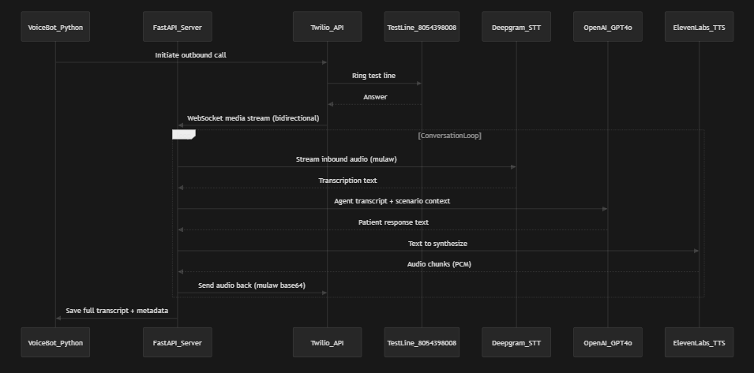

# PrettyGoodAI Voice Bot

An automated voice bot that calls a test phone line, simulates realistic patient scenarios, records transcripts, and identifies bugs in an AI medical office receptionist.

## How It Works

The bot uses Twilio to make outbound phone calls, Deepgram for real-time speech-to-text, OpenAI GPT-4o-mini for generating patient dialogue, and ElevenLabs for text-to-speech. Audio flows bidirectionally over Twilio's WebSocket Media Streams.

See [ARCHITECTURE.md](ARCHITECTURE.md) for detailed design decisions.

### Architecture Diagram



## Prerequisites

- **Python 3.11+**
- **ngrok** account and CLI installed ([ngrok.com](https://ngrok.com))
- API keys for:
  - [Twilio](https://www.twilio.com) (Account SID, Auth Token, and a phone number)
  - [Deepgram](https://deepgram.com) (API key)
  - [ElevenLabs](https://elevenlabs.io) (API key)
  - [OpenAI](https://platform.openai.com) (API key)

## Setup

### 1. Clone and install dependencies

```bash
cd PrettyGoodAI
python -m venv venv

# Windows
venv\Scripts\activate
# macOS/Linux
source venv/bin/activate

pip install -r requirements.txt
```

### 2. Configure environment variables

```bash
cp .env.example .env
```

Edit `.env` and fill in your API keys:

```
TWILIO_ACCOUNT_SID=AC...
TWILIO_AUTH_TOKEN=...
TWILIO_PHONE_FROM=+1XXXXXXXXXX
DEEPGRAM_API_KEY=...
ELEVENLABS_API_KEY=...
OPENAI_API_KEY=...
```

### 3. Start ngrok

In a separate terminal:

```bash
ngrok http 8765
```

Copy the ngrok domain (e.g., `abc123.ngrok-free.app`) and set it in your `.env`:

```
NGROK_DOMAIN=abc123.ngrok-free.app
```

### 4. Run the bot

```bash
# Run all 12 scenarios
python main.py

# Run a single scenario
python main.py --scenario simple_scheduling

# List available scenarios
python main.py --list

# Analyze existing transcripts and generate a bug report
python main.py --analyze
```

## Scenarios

| # | Name | Description |
|---|------|-------------|
| 1 | `simple_scheduling` | New patient books a general checkup |
| 2 | `rescheduling` | Existing patient moves appointment to next week |
| 3 | `cancellation` | Patient cancels upcoming appointment |
| 4 | `medication_refill` | Patient requests prescription refill |
| 5 | `office_hours` | Ask about hours and weekend availability |
| 6 | `insurance_question` | Ask about accepted insurance plans |
| 7 | `location_directions` | Ask for address, parking, directions |
| 8 | `urgent_symptoms` | Describe concerning symptoms (triage test) |
| 9 | `multiple_requests` | Insurance question + scheduling in one call |
| 10 | `confused_patient` | Scattered, forgetful caller (stress test) |
| 11 | `spanish_speaker` | English with occasional Spanish words |
| 12 | `interruption_test` | Impatient caller, tries to cut in |

## Output

- **Transcripts**: `transcripts/` - JSON files with full conversation records
- **Bug Report**: `reports/bug_report.md` - Generated analysis of agent issues

## Project Structure

```
main.py              - Entry point, orchestrates calls
server.py            - FastAPI WebSocket server (Twilio media streams)
conversation.py      - LLM conversation engine (GPT-4o-mini)
scenarios.py         - 12 patient scenario definitions
stt.py               - Deepgram streaming speech-to-text
tts.py               - ElevenLabs text-to-speech
audio_utils.py       - Audio format conversion utilities
call_manager.py      - Twilio call initiation
transcript.py        - Transcript recording and persistence
analyzer.py          - Post-call bug detection (GPT-4o)
config.py            - Configuration from environment variables
```

## Lessons Learned

Building a real-time voice bot that holds natural phone conversations surfaced several non-obvious challenges:

**Turn-taking is the hardest problem.** The initial silence timeout was 1.5 seconds--short enough to feel responsive, but it caused the bot to jump in while the agent was still mid-sentence. For example, the agent would say "The first available morning appointment is..." and the bot would respond before hearing the date. Tuning this to 2.5 seconds fixed the interruption issue at the cost of slightly slower-feeling conversation. A production system would benefit from a smarter approach--perhaps combining VAD with semantic completeness detection ("did this sentence end with a period?").

**Twilio silently drops WebSocket query parameters.** The first implementation passed the scenario name as a query parameter on the WebSocket URL. Calls connected fine but every scenario ran as `simple_scheduling` because Twilio strips custom query params from the WebSocket connection. The fix was to use `<Parameter>` elements inside the TwiML `<Stream>` noun, which delivers data through the `customParameters` field in the WebSocket `start` message. This cost about an hour of debugging and isn't called out clearly in Twilio's docs.

**SDK version mismatches are sneaky.** The Deepgram Python SDK jumped from v3 to v5 with a completely different API surface--`DeepgramClientOptions`, `LiveTranscriptionEvents`, and `LiveOptions` all disappeared. The latest version on PyPI looked right in the docs but failed at import time. Pinning to `deepgram-sdk>=3.8.0,<4.0.0` solved it. Lesson: always pin major versions for SDKs that move fast.

**The test agent has real bugs worth finding.** The AI agent consistently misidentifies callers (calling everyone "Sarah" regardless of what name they give), fails to triage urgent symptoms (asking for phone verification when a patient reports chest tightness), and frequently gets stuck in loops asking for the same information. These aren't edge cases--they appeared in the majority of calls and would meaningfully impact real patients.

**ElevenLabs native mu-law output is a huge win.** Most voice bot tutorials show a PCM -> mu-law conversion step using `audioop`. ElevenLabs supports `ulaw_8000` as a direct output format, eliminating that conversion entirely. This simplified the code and removed a potential source of audio quality issues. Not many tutorials mention this.

## Environment Variables

| Variable | Description |
|----------|-------------|
| `TWILIO_ACCOUNT_SID` | Twilio account SID |
| `TWILIO_AUTH_TOKEN` | Twilio auth token |
| `TWILIO_PHONE_FROM` | Your Twilio phone number (E.164 format) |
| `TARGET_PHONE_NUMBER` | Test line to call (default: +18054398008) |
| `DEEPGRAM_API_KEY` | Deepgram API key |
| `ELEVENLABS_API_KEY` | ElevenLabs API key |
| `ELEVENLABS_VOICE_ID` | ElevenLabs voice ID (default: Rachel) |
| `OPENAI_API_KEY` | OpenAI API key |
| `SERVER_PORT` | Local server port (default: 8765) |
| `NGROK_DOMAIN` | Your ngrok domain (without https://) |

## Cost / Billing

Total cost to run the full 12-call test suite:

| Service | Item | Cost |
|---------|------|------|
| Twilio | Subscription | $20.00 |
| Twilio | Phone number | $1.15 |
| Twilio | Call charges (12 calls) | $0.30 |
| ElevenLabs | TTS usage | $5.00 |
| OpenAI | GPT-4o-mini (conversation + analysis) | $0.03 |
| **Total** | | **$26.48** |
